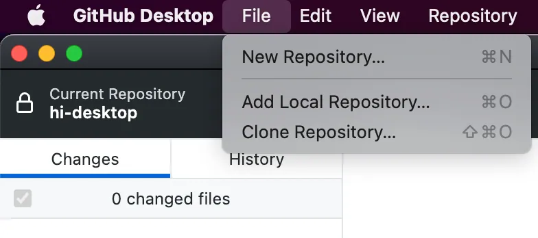
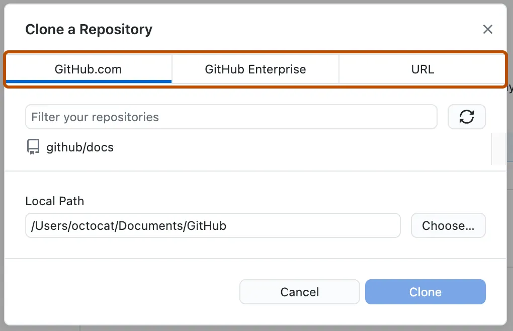
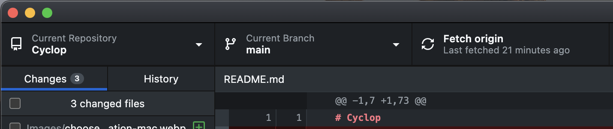
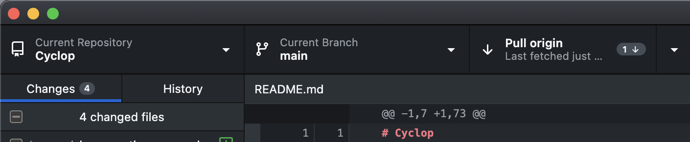
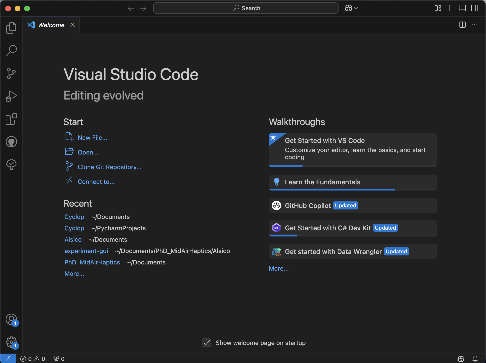
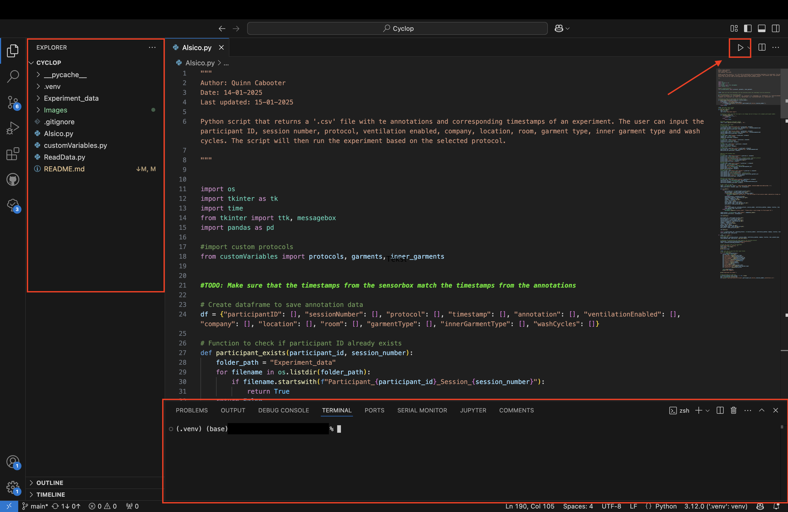
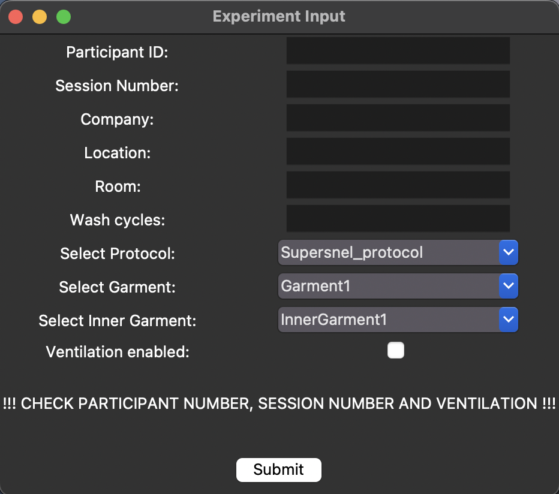

# Cyclop

This is the repository associated with the Cyclop project. This is a project where Alsico and imec-mict-UGent collaborate to investigate the effectiveness of the new Cyclop device developed by Alsico. In this README, all necessary information is given to run the scripts and perform the experiment.

## Table of contents
- [Cyclop](#cyclop)
    - [Table of contents](#table-of-contents)
    - [Folder Overview](#folder-overview)
    - [Getting started](#getting-started)
        - [Requirements](#requirements)
    - [Using GitHub Desktop](#using-github-desktop)
        - [Cloning or forking the repository](#cloning-or-forking-the-repository)
        - [Updating the scripts](#updating-the-scripts)
    - [Using VS Code](#using-vs-code)
        - [VS Code explanation](#vs-code-explanation)
        - [Executing a script](#executing-a-script)
    - [Data file storage](#data-file-storage)
    - [Contact](#contact)
## Folder Overview

The `Cyclop` directory contains the following files and folders:

Files and folders that you will use to perform the experiment:
- `Experiment_data`: A folder necessary to save experiment data.
- `Alsico vX.X.X.py`: The main file for running the experiment ***This file should not be edited without the author's knowledge***.
- `customVariables.py`: This file contains the custom variables needed for gathering identifying data for the experiment. This includes **Protocols**, **Garment types**, **Inner garment types**.
- `ReadData.py`: A file you can use to read collected data in your python IDE (e.g., Visual Studio Code or Pycharm).

Files and folders irrelevant for the experiment itself:
- `Bin`: A folder that contains old scripts.
- `Data_processing`: A folder that contains scripts regarding the processing of the data (yet to be made public).
- `Updates.md`: A file that contains a description of the updates.
- `__pycache__`: A folder generated by python (this will be in your local repository on your computer).
- `.venv`: A folder generated by the virual environment.
- `Images`: A folder with the necessary images for this README.
- `.gitignore`: A file that specifies which files are ignored by GitHub.

## Getting started
### Requirements
- `GitHub Desktop`. This is essential to quickly import updates to the scripts.
    - [Download GitHub Desktop](https://desktop.github.com/download/)
- A `python Integraded Development Environment (IDE)`. We recommend using Visual Studio Code (more flexibility) or Spyder (easier to use).
    - [Download Visual Studio Code](https://code.visualstudio.com/Download)
    - [Download Spyder](https://www.spyder-ide.org/download/)


## Using GitHub Desktop
You will use GitHub Desktop to update the scripts whenever an update is available. In this section we will explain how to use GitHub Desktop to fork this repository onto your local computer. Here, we will only explain necessary steps. For a complete guide to GitHub Desktop visit [Getting started with GitHub Desktop](https://docs.github.com/en/desktop/overview/getting-started-with-github-desktop)

### Cloning or forking the repository
When you want to close this repository, go to `GitHub Desktop`. 
1. Open GitHub Desktop.
2. Click on `File` in the menu bar.
3. Select `Clone repository`.

<p align="center">
    
</p>

4. Choose URL and enter the following URL: https://github.com/QuinnCabooter/Cyclop.

<p align='center'>

</p >
5. Select the path where you want the folder to be saved.
6. Click `Clone`.

This will create a local copy of the repository on your computer.

### Updating the scripts
When the scripts have been updated, you will need to fetch and pull the changes within GitHub Desktop. To do this, you simply need to have the `Cyclop repository` open as your current repository. 
1. Click the `Fetch origin` button. This will fetch changes to the scripts.

<p align='center'>

</p >

2. Click the `Pull origin` button. Now your local files should be synchronized with the GitHub repository.

<p align='center'>

</p >


## Using VS Code
### VS Code explanation
When opening VS Code you will see the menu as in the image below. Here, you can choose to `clone repository` (not necessary if you cloned it using GitHub Desktop) or `open...` (e.g., a folder). 

<p align='center'>

</p >

After opening the folder that you created with GitHub Desktop, you will be able to see all files in the repository on the left side of the screen inside the `Explorer`. Here you can select files and edit them. At the bottom of the screen, a `terminal` is open (or will open when running the scripts). Here, output from the scrips will be printed. We implemented some code that you can verify that your experiment is running. The `play` button on the top right op the screen will execute the script.

<p align='center'>

</p >

### Executing a script
Before you can execute the `Alsico.py`script, you might have to install some packages. The `pandas`package will have to be installed manually. In `Terminal` enter the following code:

```
pip install pandas
```

It might be necessary to install the other packages as well. To do this use the following lines of code (seperately):
````
pip install OS

pip install tkinter
````

When this is finished, you should be able to run the script without any issues. After clicking the `play` button, a new window will open where you can fill in the identifying information for that experiment (see image below):

<p align='center'>

</p >

When clicking `submit`, the experiment will start.

## Data file storage
Files created by the experiment will be stored in the `Experiment_data` folder. This data will **not** be uploaded to GitHub. To share these files, send them over via e-mail or the dedicated shared Google Drive.

**Make sure that when recording data, you change the names of the sensorbox files to correspond with the participant number and session number. The files should be named as follows:**
`Participant_*number*_Session_*number*_sensorbox_*timestamp*.csv`

## Contact
If you have feedback or if anything is unclear, reach out to quinn.cabooter@ugent.be
